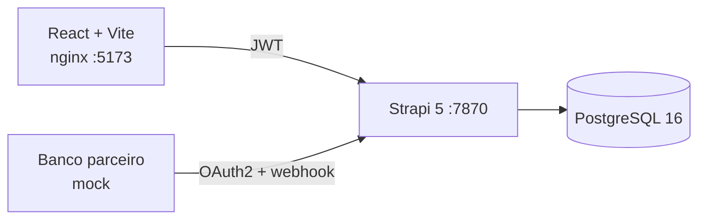

# CreditSim

Simulador de crédito (empréstimos) com API em **Strapi 5 + TypeScript + PostgreSQL** e interface em **React + Vite**. Calcula parcelas pelos sistemas **PRICE** e **SAC** com **IOF**, isola os dados por cliente com **JWT + roles**, simula a decisão de um **banco parceiro** via **OAuth2 (client credentials) + webhook** e roda inteiro em **Docker**.

Projeto de portfólio/estudo, construído por etapas com testes automatizados a cada camada.

## O que ele faz

- **Simulação de empréstimo**: valor, taxa mensal, prazo e sistema de amortização geram o plano completo de parcelas (juros, amortização, valor da parcela e saldo devedor) e o IOF.
- **Autenticação e autorização**: login via JWT (Users & Permissions) com duas roles, `Admin-app` (vê tudo) e `Customer` (vê só os próprios empréstimos), aplicadas por uma *policy* customizada.
- **Banco parceiro (mock)**: endpoint de token OAuth2 `client_credentials` e webhook que aprova ou rejeita um empréstimo, com token assinado, expiração e idempotência.
- **Frontend**: tela de login e de simulação em React + TypeScript.
- **Infra**: `docker compose` com Postgres, Strapi (imagem de produção multi-stage) e frontend (nginx).

## Arquitetura



Modelo de dados: `Customer` (1:1 com o usuário de login) → `Loan` (`principal`, taxa, prazo, sistema `PRICE`/`SAC`, IOF, `loanStatus`: `simulated` / `approved` / `rejected`) → `Installment` (parcelas).

## API

| Método | Rota | Acesso | Descrição |
|---|---|---|---|
| POST | `/api/auth/local` | público | Login, devolve o JWT |
| POST | `/api/loans/simulate` | Admin-app, Customer | Calcula e salva a simulação com as parcelas |
| GET | `/api/loans` | Admin-app, Customer | Customer vê só os seus; Admin vê todos |
| POST | `/api/partner/oauth/token` | credenciais do parceiro | Emite o token (`client_credentials`, 1h) |
| POST | `/api/webhooks/bank-decision` | Bearer do parceiro | Aprova/rejeita um loan `simulated` |

Exemplo de simulação (taxa **mensal** em decimal, `0.02` = 2%):

```json
POST /api/loans/simulate
Authorization: Bearer <jwt>

{ "data": { "principal": 5000, "interestRate": 0.02, "termMonths": 6, "amortizationSystem": "PRICE" } }
```

Webhook do banco (`decision` é `approved` ou `rejected`; repetir a chamada devolve `409`):

```json
POST /api/webhooks/bank-decision
Authorization: Bearer <access_token do parceiro>

{ "loanId": "<documentId>", "decision": "approved", "reason": "score ok" }
```

## Regras financeiras

- **PRICE**: parcela fixa, `PMT = P·i·(1+i)^n / ((1+i)^n − 1)`; juros caem e amortização cresce.
- **SAC**: amortização constante (`P/n`), parcelas decrescentes.
- **IOF**: 0,38% fixo + 0,0082% ao dia sobre o valor, com o prazo limitado a 365 dias.
- Valores arredondados em centavos. O motor fica em `app/src/api/loan/utils/finance.ts`, com funções puras e sem dependência do Strapi.

## Como rodar

### Com Docker

```bash
cp app/.env.example app/.env     # preencha os segredos (ex.: openssl rand -base64 32)
docker compose up -d --build
```

- API em `http://localhost:7870` e frontend em `http://localhost:5173`.
- O frontend lê a URL da API em tempo de build: `VITE_API_URL` no `.env` da raiz (padrão `http://localhost:7870`, sem `/api` no final).
- No `app/.env`, defina também `PARTNER_CLIENT_ID`, `PARTNER_CLIENT_SECRET` e `PARTNER_TOKEN_SECRET`.
- Em ambiente com HTTPS direto, defina `COOKIE_SECURE=true` (em `http` o cookie de refresh precisa ser não-secure).

### Desenvolvimento local

Requer Node 22.

```bash
docker compose up -d postgres
cd app && npm install && npm run develop            # API
cd frontend && npm install && npm run dev           # frontend (VITE_API_URL em frontend/.env)
```

Para o modo local, o `app/.env` precisa de `DATABASE_CLIENT=postgres`, `DATABASE_HOST=localhost` e das credenciais do serviço `postgres` do `docker-compose.yml`.

### Configuração inicial (uma vez)

No painel `/admin` do Strapi: criar as roles `Admin-app` e `Customer` em Users & Permissions e liberar as ações `simulate` e `find` do tipo Loan em ambas; criar os usuários; e criar o `Customer` vinculado ao usuário de login.

## Testes

```bash
cd app && npm test
```

**42 testes** em 4 suítes (Jest + ts-jest): motor financeiro (IOF, PRICE, SAC), serviço e controller do parceiro (token válido, adulterado e expirado; webhook com 401/400/404/409/200) e controller de empréstimos (validação, prioridade do cliente autenticado e isolamento por customer). Os controllers rodam com o Strapi mockado, sem subir o servidor.

Teste ponta a ponta (login, simulação, OAuth, webhook, idempotência), com o Strapi rodando e `jq` instalado:

```bash
CUSTOMER_PASSWORD=<senha> bash scripts/test-phase7.sh
```

## Estrutura

```
creditsim/
├── app/                    # Strapi 5 (TypeScript)
│   ├── src/api/loan/       # simulate/find, policy is-owner-or-admin, utils/finance.ts
│   ├── src/api/partner/    # OAuth mock + webhook do banco
│   ├── tests/              # Jest
│   └── Dockerfile
├── frontend/               # React + Vite + TypeScript
│   └── Dockerfile
├── scripts/test-phase7.sh  # teste ponta a ponta
└── docker-compose.yml
```

## Decisões e limites

- **Isolamento por cliente**: a policy resolve o `Customer` do usuário logado e injeta o id no contexto. O controller usa esse id e ignora o `customerId` enviado no body.
- **Token do parceiro**: stateless, assinado com HMAC-SHA256 e comparado em tempo constante; as rotas do parceiro são públicas (`auth: false`) e a segurança está no Bearer.
- **Idempotência**: o webhook só decide loans em `simulated`; qualquer repetição devolve `409`.
- **CORS aberto (`*`)** por simplicidade no estudo; em produção, restringir a origem.
- O banco parceiro é simulado: não há integração real, e o campo `interestRates` do `Loan` ainda tem o nome com "s" (ajuste cosmético pendente).
